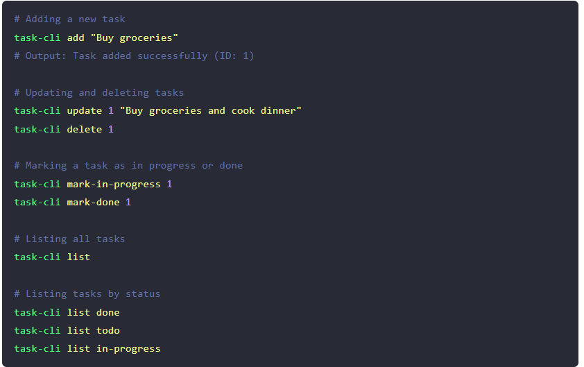

[
# Task Tracker

Build a CLI app to track your tasks and manage your to-do list.

Task tracker is a project used to track and manage your tasks. In this task, you will build a simple command line interface (CLI) to track what you need to do, what you have done, and what you are currently working on. This project will help you practice your programming skills, including working with the filesystem, handling user inputs, and building a simple CLI application.

## Requirements

The application should run from the command line, accept user actions and inputs as arguments, and store the tasks in a JSON file. The user should be able to:

- Add, Update, and Delete tasks
- Mark a task as in progress or done
- List all tasks
- List all tasks that are done
- List all tasks that are not done
- List all tasks that are in progress

## Example

## Task Properties
 Each task should have the following properties:

- id: A unique identifier for the task
- description: A short description of the task
- status: The status of the task (todo, in-progress, done)
- createdAt: The date and time when the task was created
- updatedAt: The date and time when the task was last updated

](https://roadmap.sh/projects/task-tracker)
